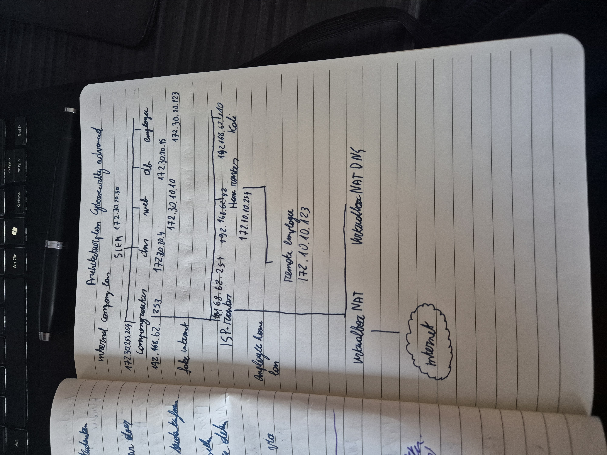

# Lab 8: IPsec

Ik begon met het tekenen van een netwerkdiagram om de verschillende componenten en hun verbindingen in het IPsec-lab te visualiseren. Dit hielp me om een duidelijk overzicht te krijgen van hoe de verschillende apparaten met elkaar communiceren.



Hierna sshde ik naar de homerouter om de routing aan te zetten. 

Ik maakte ook een route aan naar het fake internet:

```bash
sudo ip route add 172.30.0.0/16 via 192.168.62.253
```

Ik controlleerde ook of het verkeer niet via de ISP-router ging:

```bash
[vagrant@homerouter ~]$ traceroute 172.30.20.4
traceroute to 172.30.20.4 (172.30.20.4), 30 hops max, 60 byte packets
 1  * * *
 2  192.168.62.253 (192.168.62.253)  0.363 ms  0.402 ms  0.381 ms
 3  172.30.20.4 (172.30.20.4)  0.685 ms  0.637 ms  0.619 ms
```

## MitM attack

Hierna startte ik de kali VM op om de Man in the Middle attack uit te voeren. Ik gebruikte hiervoor het volgende commando:

```bash
sudo ettercap -Tq -i eth0 -M arp:remote /192.168.62.42// /192.168.62.253//
```

We starten ook wireshark om het verkeer te monitoren met het commando:

```bash
sudo wireshark &
```

We zetten een filter op:

icmp || esp

en nu pingen we van de remote-employee naar de webserver:

```bash
ping 172.30.10.10 
```


## IPsec setup

Hierna maakte ik een bestand aan op de homerouter om het script uit de opgave in te plakken en te kunnen uitvoeren op de vm

```bash
#!/usr/bin/env sh

# 1. Opschonen
sudo ip xfrm state flush
sudo ip xfrm policy flush

# 2. Variabelen (Zorg dat deze exact hetzelfde zijn op beide routers)
SPI_HOME_TO_COMP=0x007
KEY_HOME_TO_COMP=0xFEDCBA9876543210FEDCBA9876543210

SPI_COMP_TO_HOME=0x008
KEY_COMP_TO_HOME=0x8c51dbe8f193bddddf5d91efd3f7b9fb

# 3. States (SA) - Hoe we versleutelen en ontsleutelen
# Uitgaand naar Company
sudo ip xfrm state add src 192.168.62.42 dst 192.168.62.253 proto esp spi $SPI_HOME_TO_COMP mode tunnel enc aes $KEY_HOME_TO_COMP
# Inkomend van Company
sudo ip xfrm state add src 192.168.62.253 dst 192.168.62.42 proto esp spi $SPI_COMP_TO_HOME mode tunnel enc aes $KEY_COMP_TO_HOME

# 4. Policies (SP) - Welk verkeer moet de tunnel in/uit
# OUT: Van Home-LAN naar Company-LAN
sudo ip xfrm policy add src 172.10.10.0/24 dst 172.30.0.0/16 dir out tmpl src 192.168.62.42 dst 192.168.62.253 proto esp spi $SPI_HOME_TO_COMP mode tunnel
# FWD/IN: Van Company-LAN naar Home-LAN (doorsturen naar de employee)
sudo ip xfrm policy add src 172.30.0.0/16 dst 172.10.10.0/24 dir fwd tmpl src 192.168.62.253 dst 192.168.62.42 proto esp spi $SPI_COMP_TO_HOME mode tunnel
sudo ip xfrm policy add src 172.30.0.0/16 dst 172.10.10.0/24 dir in tmpl src 192.168.62.253 dst 192.168.62.42 proto esp spi $SPI_COMP_TO_HOME mode tunnel

echo "Homerouter IPsec configuratie voltooid."
```

Ik paste dit script aan om het ook op de companyrouter te kunnen uitvoeren:

```bash
#!/usr/bin/env sh

# 1. Opschonen
sudo ip xfrm state flush
sudo ip xfrm policy flush

# 2. Variabelen (Identiek aan Homerouter)
SPI_HOME_TO_COMP=0x007
KEY_HOME_TO_COMP=0xFEDCBA9876543210FEDCBA9876543210

SPI_COMP_TO_HOME=0x008
KEY_COMP_TO_HOME=0x8c51dbe8f193bddddf5d91efd3f7b9fb

# 3. States (SA)
# Inkomend van Home
sudo ip xfrm state add src 192.168.62.42 dst 192.168.62.253 proto esp spi $SPI_HOME_TO_COMP mode tunnel enc aes $KEY_HOME_TO_COMP
# Uitgaand naar Home
sudo ip xfrm state add src 192.168.62.253 dst 192.168.62.42 proto esp spi $SPI_COMP_TO_HOME mode tunnel enc aes $KEY_COMP_TO_HOME

# 4. Policies (SP)
# OUT: Van Company-LAN naar Home-LAN
sudo ip xfrm policy add src 172.30.0.0/16 dst 172.10.10.0/24 dir out tmpl src 192.168.62.253 dst 192.168.62.42 proto esp spi $SPI_COMP_TO_HOME mode tunnel
# FWD/IN: Van Home-LAN naar Company-LAN (doorsturen naar de webserver)
sudo ip xfrm policy add src 172.10.10.0/24 dst 172.30.0.0/16 dir fwd tmpl src 192.168.62.42 dst 192.168.62.253 proto esp spi $SPI_HOME_TO_COMP mode tunnel
sudo ip xfrm policy add src 172.10.10.0/24 dst 172.30.0.0/16 dir in tmpl src 192.168.62.42 dst 192.168.62.253 proto esp spi $SPI_HOME_TO_COMP mode tunnel

echo "Companyrouter IPsec configuratie voltooid."
```

Nu kunnen we onopgemerkt pingen van de remote-employee naar de webserver:

```bash
[vagrant@remote-employee ~]$ ping 192.168.62.42
PING 192.168.62.42 (192.168.62.42) 56(84) bytes of data.
64 bytes from 192.168.62.42: icmp_seq=1 ttl=64 time=0.166 ms
64 bytes from 192.168.62.42: icmp_seq=2 ttl=64 time=0.389 ms
64 bytes from 192.168.62.42: icmp_seq=3 ttl=64 time=0.324 ms
64 bytes from 192.168.62.42: icmp_seq=4 ttl=64 time=0.371 ms
64 bytes from 192.168.62.42: icmp_seq=5 ttl=64 time=0.397 ms
^C
--- 192.168.62.42 ping statistics ---
5 packets transmitted, 5 received, 0% packet loss, time 4077ms
rtt min/avg/max/mdev = 0.166/0.329/0.397/0.085 ms
```

We zien in wireshark enkel ESP verkeer langskomen:


Ik voegde in de firewall op de companyrouter nog enkele regels toe om het verkeer toe te laten:

Deze om het verkeer van de remote-employee naar de intranet en dmz toe te laten:
ip saddr 192.168.62.42 ip protocol esp accept

En deze om het antwoordverkeer van de intranet en dmz naar de remote-employee toe te laten:

ip saddr 172.10.10.0/24 ip daddr { $dmz_net, $intranet_net } accept

## Decryption 

Decryption¶

You are using static keys, opposed to what IKE would organize for you. But knowing the key, and the SPI: can you decrypt the traffic you have captured in Wireshark?

Ja, wireshark heeft een ingebouwde functionaliteit om IPsec ESP-verkeer te decoderen als je de juiste sleutels en SPI's hebt. 

We gaan naar de ESP instellingen in Wireshark:

1. Open Wireshark
2. Ga naar Edit -> Preferences.
3. Open ESP

Nu moeten we de sleutels toevoegen:

4. Vink het vakje Attempt to detect/decode encrypted ESP payloads aan.
5. Klik op de knop Edit... naast ESP SAs.
6. Klik op het + icoontje om een nieuwe SA toe te voegen.

Vul de volgende gegevens in voor de eerste richting (Home -> Company):

- Src IP: 192.168.62.42
- Dest IP: 192.168.62.253
- SPI: 0x00000007 (of 7)
- Encryption Algorithm: AES-CBC [RFC3602]
- Encryption Key: 0xFEDCBA9876543210FEDCBA9876543210 (zonder de 0x als Wireshark klaagt)
- Authentication Algorithm: NULL (we hebben in het script geen auth gedefinieerd).

Herhaal dit voor de tweede richting (Company -> Home):

- Src IP: 192.168.62.253
- Dest IP: 192.168.62.42
- SPI: 0x00000008
- Encryption Algorithm: AES-CBC [RFC3602]
- Encryption Key: 0x8c51dbe8f193bddddf5d91efd3f7b9fb


Nu is het verkeer gedecodeerd en kunnen we de ICMP-pakketten zien:

